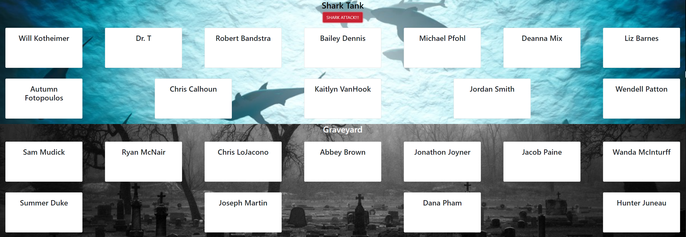

# Shark Attack
This site was built to solidify our knowledge of React, specifically passing props and state.

## Site Link/Build Status
[Shark Attack Link](https://shark-attackjm.netlify.app/)

## Technologies
- ReactJS
- Axios
- Firebase
- SASS

## Screenshot

